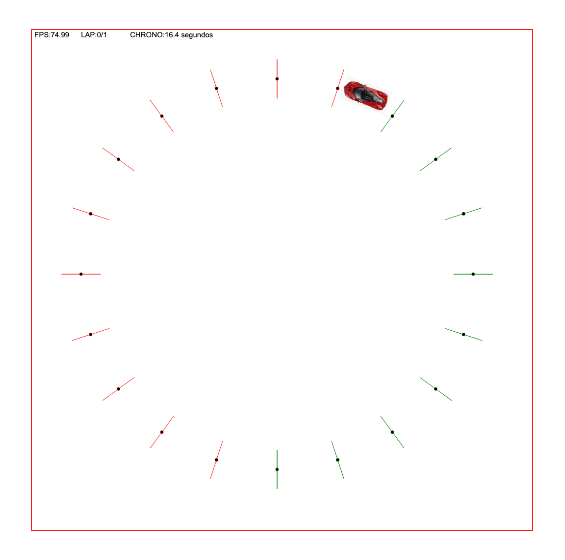

# Canvas car {

[TRY HERE! 🚀](https://amargopastor.github.io/canvas-car/)

  

## Table of Contents

1. [Technologies](#technologies)
1. [About the game](#about-the-game)
1. [Set Up](#set-up)
1. [Commands Availables](#commands-availables)
1. [Keymap](#keymap)
1. [Project tree](#project-tree)
1. [Honorable mentions](#project-tree)

# Technologies

- [NodeJS](https://nodejs.org/)
- [yarn](https://classic.yarnpkg.com/en/)
- [Typescript](https://www.typescriptlang.org/)
- [Eslint](https://eslint.org/)

## About the game

Exciting racing game where you must complete a fast lap in the shortest time possible!

## Set Up

(...)

## Commands Availables

(...)

## Keymap

| Move          | Player 1 |
| ------------- | -------- |
| Gas           | ⬆        |
| Turn right    | ➡        |
| Brake/Reverse | ⬇        |
| Turn left     | ⬅        |

## Project tree

(...)

## Honorable mentions

🍍

**[⬆ back to top](#table-of-contents)**
